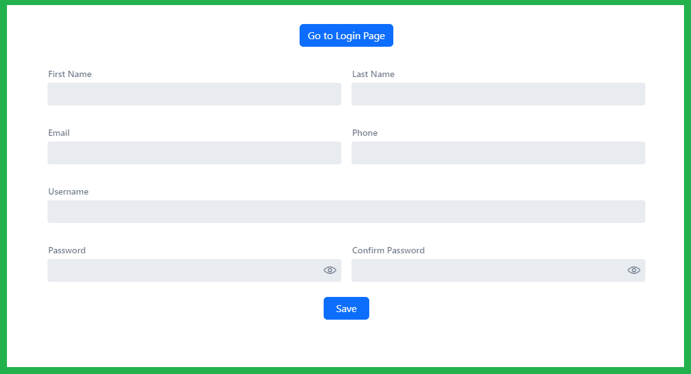
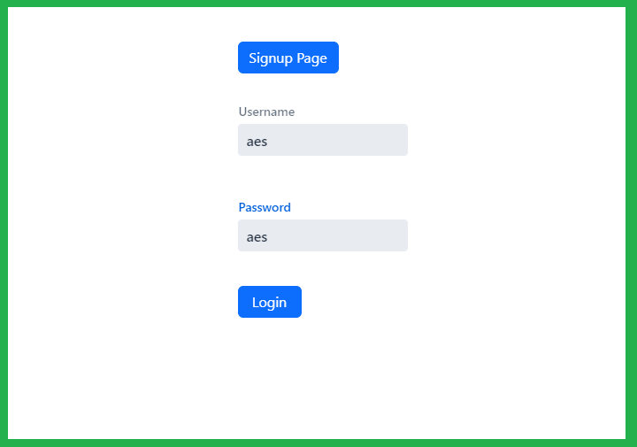
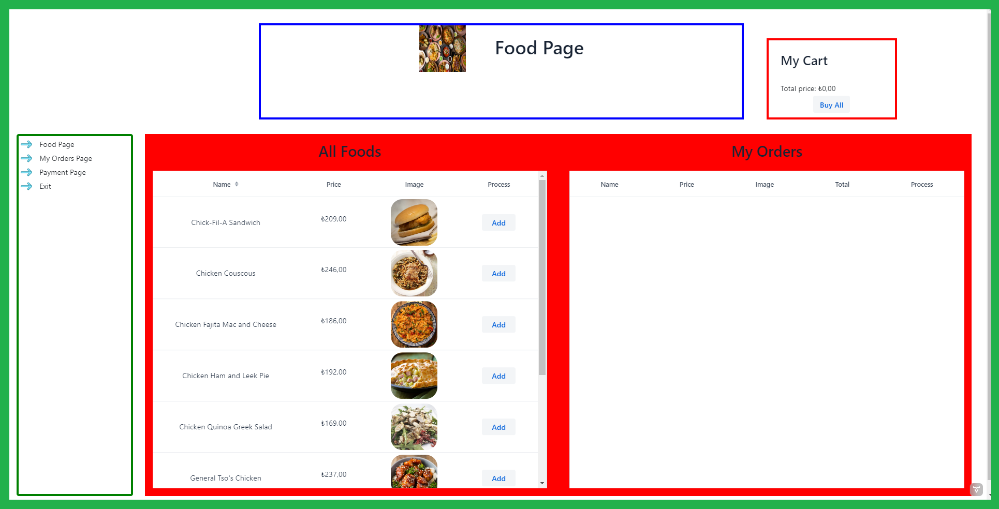
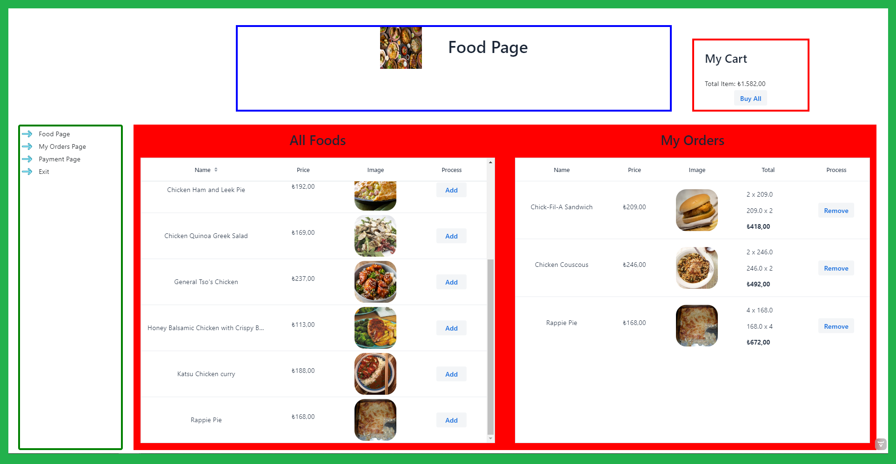
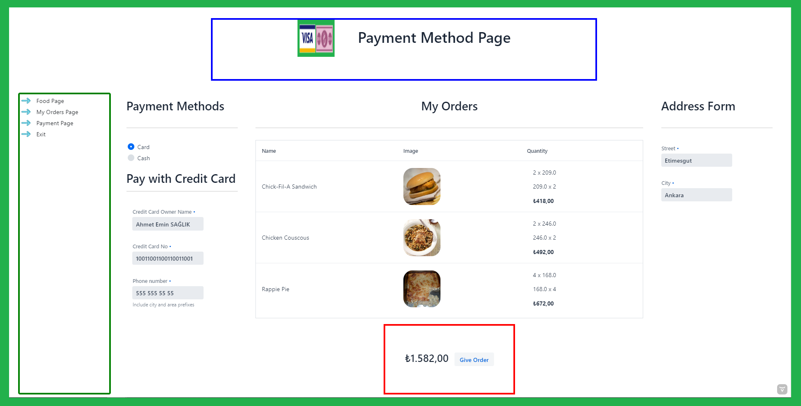
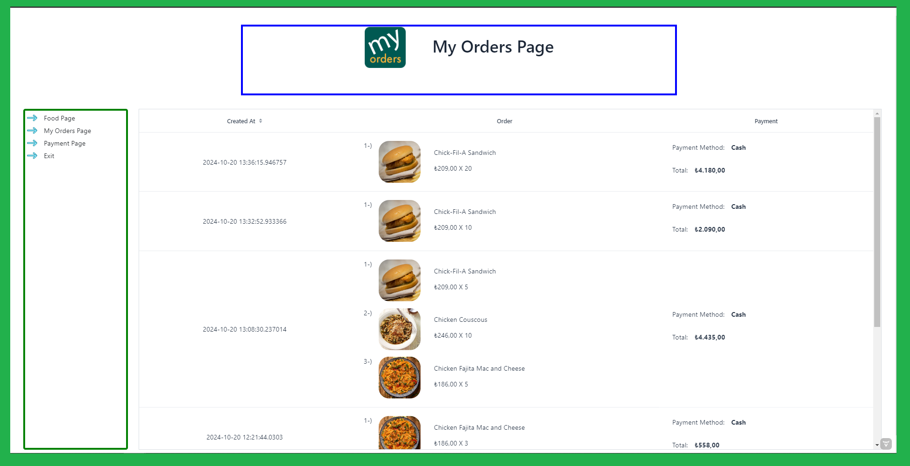
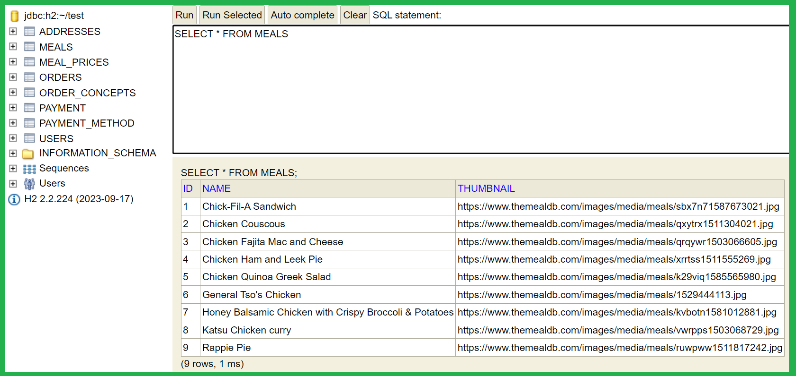
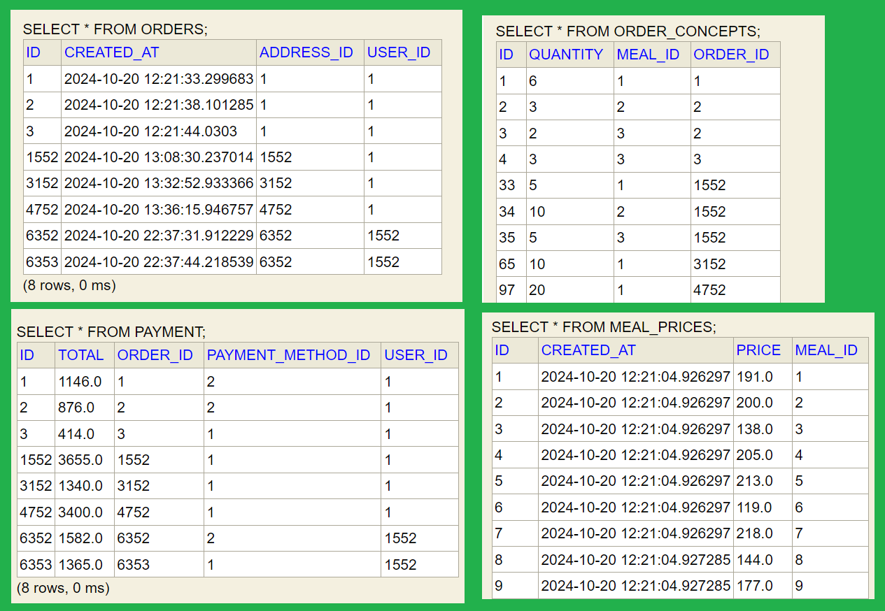

# Vaadin Food Ordering App Demo

## Content

<ol>
        <a href="#about-project"><li>About The Project</li></a>
        <a href="#why-project-created"><li>Why The Project Is Created?</li></a>
        <a href="#used-technologies"><li>Used Technologies</li></a>
        <a href="#image"><li>Images </li></a>
        </li>
        <a href="#requirements"><li>Requirements</li></a>
         <a href="#quick-start"><li>Quick Start</li></a>
         <ol>
</ol>

## <span id="about-project">1-) About The Project</span>


***Vaadin-Food-App*** is a demo food ordering application built with the Vaadin framework. It showcases user authentication, meal selection from an external API (TheMealDB), and payment processing.

Key aspects of the project include:
- UI created using Vaadin's default component designs
- Models for managing User, Address, Order, Order Concept, Meal, Meal Price, Payment, and Payment Methods
- Integration with TheMealDB for retrieving meal options
- User registration and login functionality
- Order placement with multiple payment options (credit card or cash)

This project was developed as a learning exercise with limited time, demonstrating the capabilities of Vaadin for building web applications.


## <span id="why-project-created">2-) Why The Project Is Created?</span >

***Vaadin-Food-App*** is a basic demo food app project. This project is created to learn vaadin components.

## <span id="used-technologies">3-) Used Technologies</span>

## <span id="used-technologies">Used Technologies</span>

* Backend:
  * Java SE
  * Spring Boot
  * Spring Data JPA
* Frontend:
  * Vaadin Framework
* Database:
  * H2 (in-memory database)
* External API:
  * TheMealDB API
* Build Tool:
  * Maven 
* Dependencies:
  * com.vaadin:vaadin-bom:24.4.13
  * org.springframework.boot:spring-boot-starter-data-jpa
  * com.h2database:h2:runtime
  * org.apache.httpcomponents:httpclient:4.5.13
  * com.fasterxml.jackson.core:jackson-databind

## <span id="image">4-) Images </span>


 <br><br>

 <br><br>

<br><br>

<br> <br>

<br> <br>

 <br><br>

 <br><br>

 <br><br>


## <span id="requirements">5-) Requirements</span>

* <a href="https://www.oracle.com/tr/java/technologies/javase/jdk21-archive-downloads.html">JDK 21</a>
* <a href="https://www.jetbrains.com/idea/download/?section=windows"> IntelliJ IDEA (Community Edition) </a>

## <span id="quick-start">Quick Start</span>

**1.** Clone the repository:
```
git clone https://github.com/AhmetEminSaglik/Learning-Vaadin.git
```
**2.** Open the project in IntelliJ IDEA.

**3.** Ensure you have JDK 21 installed and selected in the project settings.

**4.** Run the main application class (usually named `Application` or `VaadinFoodAppApplication`).

**5.** Open a web browser and navigate to `http://localhost:8080` (or the port specified in your application.properties).

**6.** You can now register a new user account or log in to explore the application.
